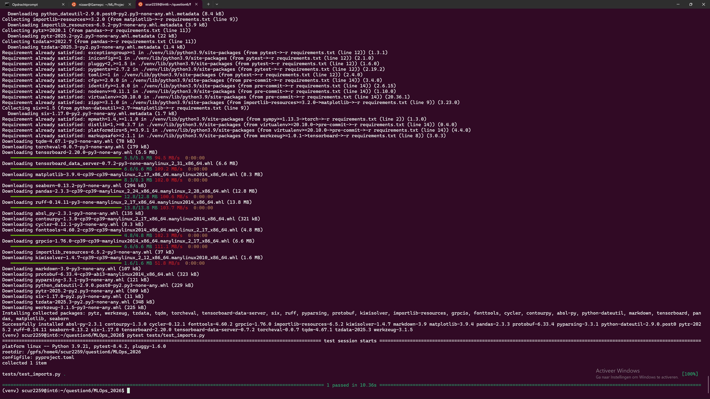
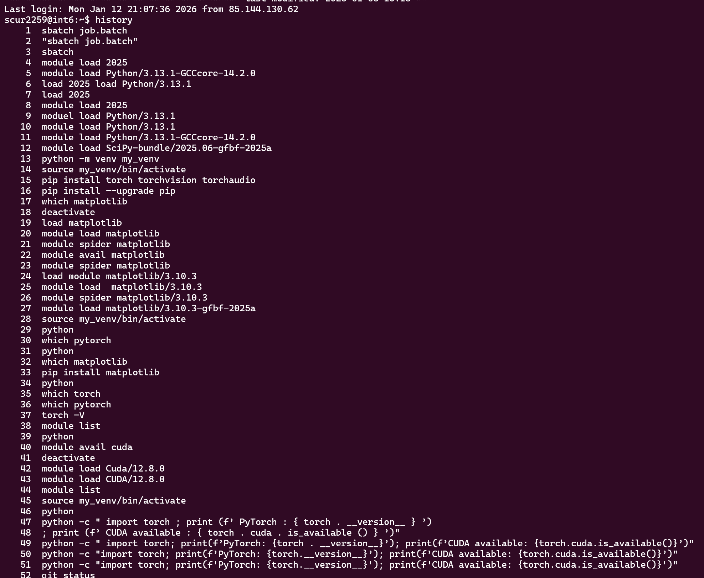
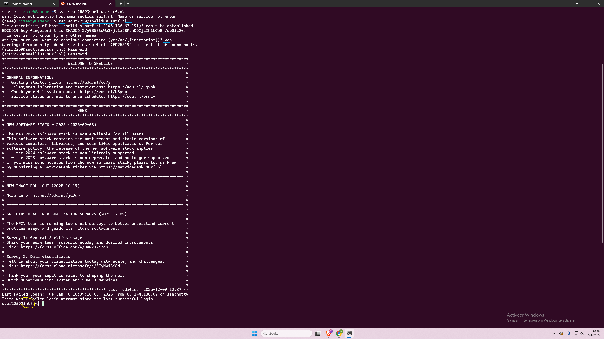
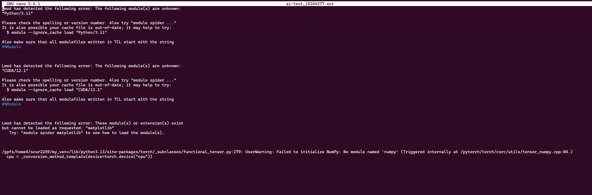
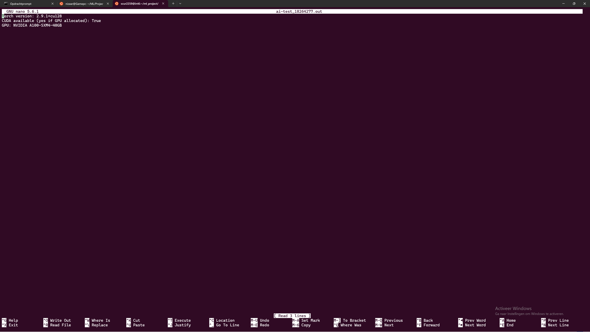
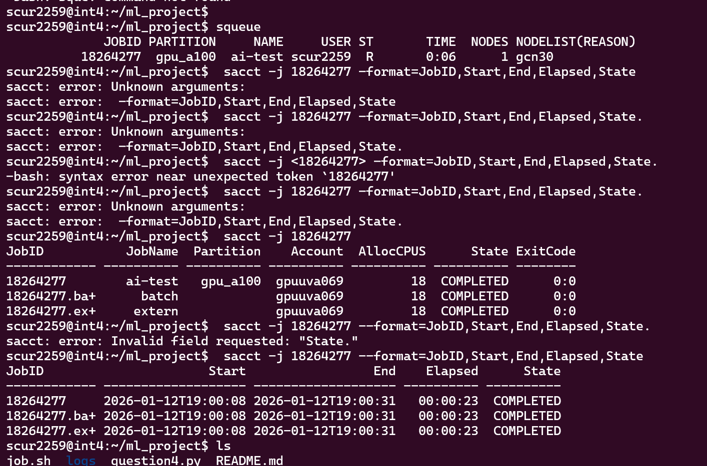

# Assignment 1: Setup & Debugging Journal
**MLOps & ML Programming (2026)**

## Student Information
* **Name:** `[Nizaar Cherdud Amri]`
* **Student ID:** [1778118]
* **TA Name:** `[Darius Barsony]`
* **GitHub Repository:** [https://github.com/Nizaar-Ch/Snellius_test_repo](https://github.com/Nizaar-Ch/Snellius_test_repo)
* **Base Skeleton Used:** [https://github.com/SURF-ML/MLOps_2026/tree/main](https://github.com/SURF-ML/MLOps_2026/tree/main)

---
Example including an image:

---

## Question 1: First Contact with Snellius
1. **Connection Details:**
   - **Command:** `[ssh scur2259@snellius.surf.nl]`
   - **Login Node:**  `[int5]`
   - **Screenshot:** `[link]`

2. **Issues Encountered:**
   - **Error Message:** `[Only misstyped password: no error message]`
   - **Resolution:** `[Typing proper password]`

3. **Smooth Connection (If applicable):**
   - **SSH Client:** `[OpenSSH_8.9p1]`
   - **Prior Experience:** `Webtech Project requirde ssh use for git`
   - **Preemptive Steps:** `[None]`

---

## Question 2: Environment Setup
1. **Setup Sequence:**
   - **Commands:** [Paste output of history]
   

   - **Full Venv Path:** `[/usr/bin/python]`

2. **Pip Install Torch:**
   - **Duration:** `[It took about 4 minutes]`
   - **Warnings:** `[No warings but request to update to latest version 24.3.1 -> 25.3]`
   - **Venv Size:** `[19G     .]`

3. **Mistakes/Unexpected Behavior:**
`I had trouble finding the right matplotlib extension to load onto my node. Just ''matplotlib'' did not work. I had to search for the available matplotlib extension using ''avail'' and then loaded matplotlib/3.10.3-gfbf-2025a. After which i could still not import it into my python environment, so i decided to pip install it`
4. **Verification:**
   - **Output:** `[PyTorch: 2.9.1+cu128 /nl CUDA available: False]`
   - **Explanation:** `[CUDA is the software to run GPUs with, so it returns false because the login node does not offer GPU resources]`
---

## Question 3: Version Control Setup
1. **GitHub URL:** [https://github.com/Nizaar-Ch/Snellius_test_repo]
2. **Authentication:** [SSH] + `[I had an error for the ssh key that was not yet installed on the node but had to be added to my git account as well. git@github.com: Permission denied (publickey). fatal: Could not read from remote repository. Please make sure you have the correct access rights]`
3. **.gitignore:**
   - **Contents:** 
   
[# Python
`__pycache__`/
*.pyc

[# Virtual environments]
venv/
env/
gpu_env/

[# SLURM]
logs/
*.out
*.err

[# Data and models]
data/
*.pt
*.pth
*.ckpt]

   - **Important items to include:** `[The data and error logs as well as the py environment]`
   - **README info:**
  [ Only the software that was used like the modules and imports, but not the steps taken to set up an account or request access to a node.]
4. **Git Log:** `[85a4a78 (HEAD -> main, origin/main) assignment_1_example.md
3158007 assignment_1_example.md
84075f6 assignment_1_example.md
2617de4 assignment_1_example.md
70a60ba assignment_1_example.md]`

---

## Question 4: Your First Batch Job (Slurm)
1. **Files Provided:** [job.sh: on [https://github.com/Nizaar-Ch/Snellius_test_repo/blob/main/job.sh](https://github.com/Nizaar-Ch/Snellius_test_repo/blob/main/job.sh)]

2. **Job ID & Stats:** `
[JobID                      Start                 End    Elapsed      State
------------ ------------------- ------------------- ---------- ----------
18264277     2026-01-12T19:00:08 2026-01-12T19:00:31   00:00:23  COMPLETED
18264277.ba+ 2026-01-12T19:00:08 2026-01-12T19:00:31   00:00:23  COMPLETED
18264277.ex+ 2026-01-12T19:00:08 2026-01-12T19:00:31   00:00:23  COMPLETED]`

3. **Submission Problem:** [At first i used the wrong partition name: gpu instead of gpu_a100. 
Error:  sbatch: error: Batch job submission failed: Invalid partition name specified
Solution: I searched for correct partition names using the sinfo command]

4. **Verification:** [Proof that script ran successfully]

5. **Login vs Batch:** [The main difference is that a login node does not grant access to a gpu to compute heavier tasks. And that those recources need to be requested manually] 
6. **Why Clusters?:**  [A cluster gives the capacity to do multiple computations in parallel, which is usefull for data science when a large amount of matrix multiplication need to be done]
---

## Question 5: Reflection & Conceptual Understanding
1. **The Filesystem:**
   - **I/O Performance:** [For each file, there are specific operations that need to be done to store data. Meaning that the time complexity is not linear for just the amount of data, but also for the amount of files. ]
   - **Mitigation Strategies:** [Merging small files into one big file] and [Storing files locally on a node to avoid the spread filing system that's optimized for large files]
   - **Dataset Versioning:** [That would require a stored record of dataset versions on the snellius storage system, where every new dataset is a deepcopy of the previous one on a different path.]
2. **Reproducibility:** [Different software used (modules python version etc.), different recourse requests (SLURM job partitions etc.), randomness + MLOps fixes]
Software: keep track of required modules and imports in README.md.
Recources: keep track of SLURM requests, make sure all are mimicked in an exact manner.
Randomness: generally always there, but ensure to use similar seeds for randommized procedures.
3. **Conda vs venv vs uv:** [environments, Pro's, Con's]
[Conda: easy local development, has its own module system]
[Venv: compatible with Snellius module system, not compatible with CUDA]
[uv: light program, so new it has little documentation]

---

## Question 6: Package Integrity
1. **ModuleNotFoundError:** [I did not have torch and torchvision installed in the isolated environment when a i ran the command. After installing manually with pip, i found out i needed to install the requirements.txt]
2. **Import Abstraction:** [It is less prone to detailed updates, meaning the code still works if the datafile name inside of the folder is changed. Also, it is more readable.]
3. **Pytest Result:** `[
=================================================================================================================== test session starts=====================================================================================================================
platform linux -- Python 3.9.21, pytest-8.4.2, pluggy-1.6.0
rootdir: /gpfs/home4/scur2259/question6/MLOps_2026
configfile: pyproject.toml
collected 1 item

tests/test_imports.py .                                                                                                                                                                                                                              [100%]

==================================================================================================================== 1 passed in 10.36s ====================================================================================================================]`

---

## Question 7: The Data Pipeline
1. **Implementation:** `[Paste __getitem__ method]`
2. **Local Pytest:** `[Paste output of pytest tests/test_pcam_pipeline.py]`
3. **CI Pipeline:**
   - **Screenshot:** 
   - **Reflection:** [CI vs Local discrepancies]
4. **Sampling Math:** [Average positives with vs without WeightedRandomSampler]
5. **EDA Plots:**
   - 
   - [Additional plots as requested]

---

## Question 8: Model Implementation (MLP)
1. **Forward Pass:** [Error details + dimension calculation for (3, 96, 96)]
2. **Weight Updates:** [Why check backprop explicitly?]
3. **Test Output:** `[Paste output of pytest on the relevant file]`

---

## Question 9: Training Loop & Loss Visualization
1. **Training Execution:** [Method used + Node ID (gcnXX)]
2. **Loss Visualization:**
   - **Plot:** 
   - **Trajectory Analysis:** [Healthy curve? Trajectory hypothesis?]
3. **Most Frustrating Error:**
   - **Error Message:** `[Traceback]`
   - **Debugging Steps:** [How you resolved it]

---

## Final Submission Checklist
- [ ] Folder contains .md file and assets/ folder?
- [ ] Name and Student ID on page 1?
- [ ] All code/terminal snippets are in backtick blocks?
- [ ] All images use relative paths (e.g., assets/pcam.png)?
- [ ] Slurm .sh and .out files included in the .zip?